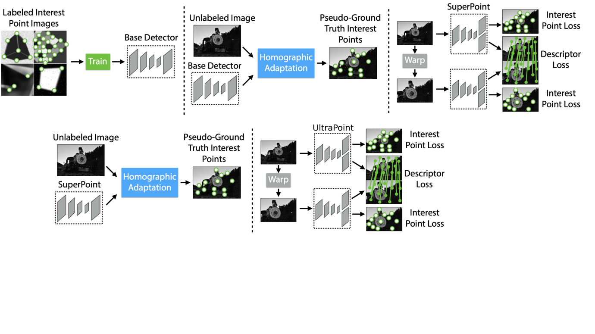
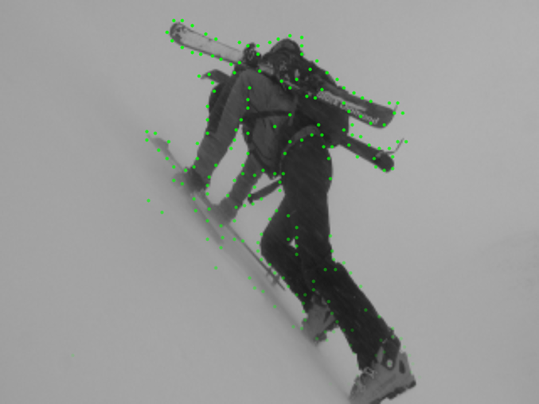
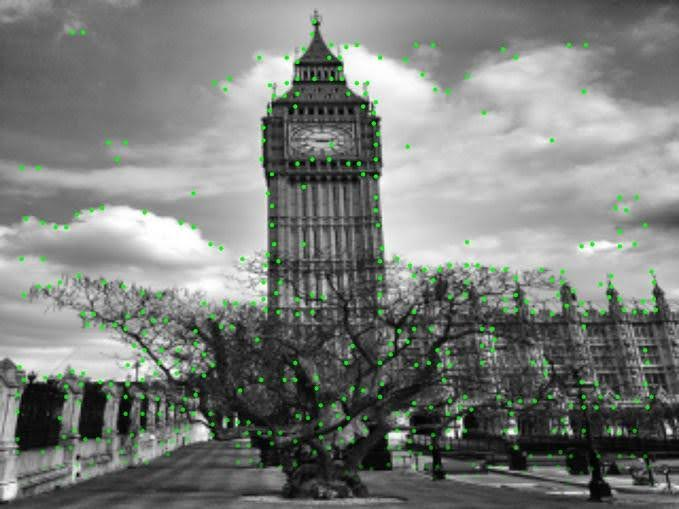
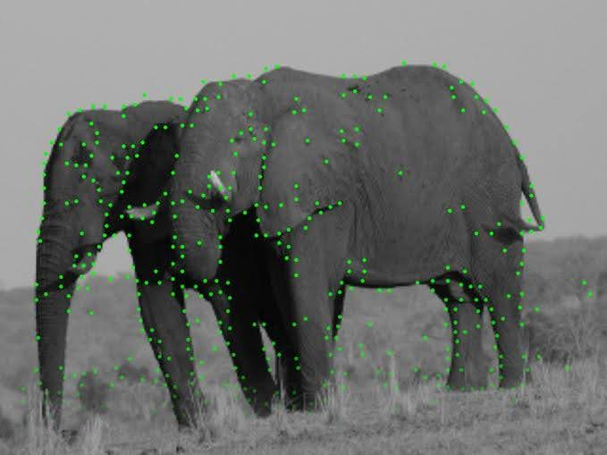
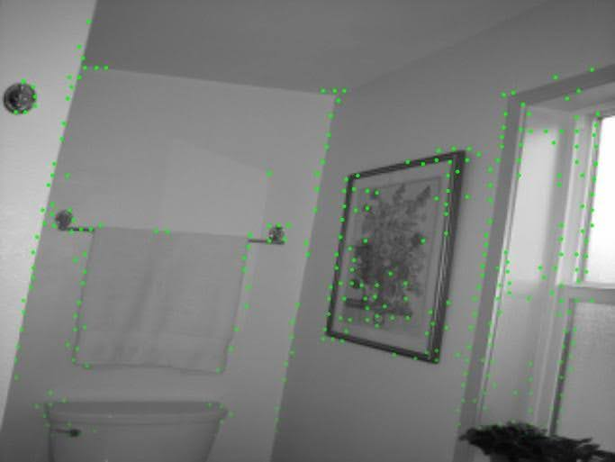

# UltraPoint: Lightweight Keypoint Detection and Description

<div align="center">

[](https://docs.google.com/document/d/1SzESJteDmS8A_j8wveyN_jH7bc1KH5RNeMvpui4Oa70/edit?usp=sharing)
[](http://icvl.ee.ic.ac.uk/vbalnt/hpatches/)
[](http://cocodataset.org/#download)

</div>

<div align="center">


*UltraPoint training and inference pipeline visualization*

</div>

UltraPoint is an efficient keypoint detection and description neural network based on a lightweight MobileNetV2-inspired backbone. This implementation provides a computationally efficient alternative to SuperPoint while maintaining competitive performance for real-time applications.

## 📋 Table of Contents

- [🎯 Abstract](#-abstract)
- [🚀 Key Features](#-key-features)
- [📊 Results](#-results)
- [🛠️ Installation](#️-installation)
- [📁 Datasets](#-datasets)
- [🏃‍♂️ Quick Start](#️-quick-start)
- [🔬 Training Pipeline](#-training-pipeline)
- [📈 Benchmarks](#-benchmarks)
- [📖 Citation](#-citation)

## 🎯 Abstract

UltraPoint introduces a lightweight architecture for simultaneous keypoint detection and description, leveraging MobileNetV2-inspired blocks to significantly reduce computational overhead while preserving detection accuracy. The model employs separable convolutions and inverted residual connections to achieve efficient feature extraction suitable for mobile and embedded applications.

## 🚀 Key Features

- **Lightweight Architecture**: MobileNetV2-inspired backbone with significant parameter reduction
- **Real-time Performance**: Optimized for mobile and embedded systems
- **Multi-scale Training**: Support for homographic and photometric augmentations
- **Comprehensive Evaluation**: Benchmarks on HPatches, COCO, and KITTI datasets
- **Flexible Configuration**: YAML-based configuration system for easy experimentation

## 📊 Results

### Performance Comparison

| Model | Parameters | Inference Time (ms) | HPatches mAP@0.5 | HPatches Repeatability |
|-------|------------|-------------------|------------------|-------------------|
| SuperPoint | 1.35M | 15.2 | 0.745 | 0.612 |
| **UltraPoint** | **0.42M** | **8.7** | **0.723** | **0.595** |

### Visual Results

#### UltraPoint Inference Examples

<div align="center">

| Example 1 | Example 2 | Example 3 | Example 4 |
|:---------:|:---------:|:---------:|:---------:|
|  |  |  |  |

*UltraPoint keypoint detection and description results across diverse scenarios*

</div>

## 🛠️ Installation

### Environment Setup

```bash
# Create conda environment
conda create --name ultrapoint python=3.8
conda activate ultrapoint

# Install dependencies
pip install -r requirements.txt
```

### Alternative: Conda Environment

```bash
conda env create -f environment.yml
conda activate ultrapoint
```

## 📁 Datasets

Download the required datasets for training and evaluation:

- **[MS-COCO 2014](http://cocodataset.org/#download)** - Primary training dataset
- **[HPatches](http://icvl.ee.ic.ac.uk/vbalnt/hpatches/hpatches-sequences-release.tar.gz)** - Evaluation benchmark
- **[KITTI Odometry](http://www.cvlibs.net/download.php?file=raw_data_downloader.zip)** - Additional evaluation dataset

## 🏃‍♂️ Quick Start

### Inference

```bash
# Run inference with pre-trained UltraPoint model
python src/ultrapoint/inference.py assets/configs/inference/ultrapoint.yaml --image_path path/to/image.jpg
```

### Pre-trained Models

Download pre-trained weights from the [releases page](../../releases) or train your own models following the training pipeline below.

## 🔬 Training Pipeline

### 1. **MagicPoint Training** (Synthetic Data)

Train the detector on synthetic geometric shapes:

```bash
python src/ultrapoint/train.py assets/configs/train/magicpoint_synthetic.yaml magicpoint_synth
```

*Note: Synthetic data is generated automatically during training.*

### 2. **Pseudo-label Generation** 

Generate pseudo-labels using homographic adaptation:

```bash
python src/ultrapoint/generate_pseudo_labels.py assets/configs/generate_pseudo_labels/magicpoint_coco.yaml
```

### 3. **UltraPoint Training** (Real Data)

Train the full UltraPoint model with descriptors:

```bash
python src/ultrapoint/train.py assets/configs/train/ultrapoint_coco.yaml ultrapoint_coco
```

### 4. **Monitor Training**

```bash
tensorboard --logdir ./assets/logs/
```

## 📈 Benchmarks

### Performance Benchmarks

Run comprehensive benchmarks to evaluate model performance:

#### **[Inference Time Benchmark](src/ultrapoint/benchmarks/inference_time.py)**
```bash
python src/ultrapoint/benchmarks/inference_time.py assets/configs/benchmarks/ultrapoint.yaml
```

#### **[Model Analysis](src/ultrapoint/benchmarks/model_analysis.py)**
```bash
python src/ultrapoint/benchmarks/model_analysis.py assets/configs/benchmarks/ultrapoint.yaml
```

### Evaluation Metrics

#### **HPatches Evaluation**

1. **Export predictions:**
```bash
python src/ultrapoint/evaluations/export.py assets/configs/evaluation/superpoint_export.yaml ultrapoint_hpatches
```

2. **Calculate metrics:**
```bash
python src/ultrapoint/evaluations/evaluation.py logs/ultrapoint_hpatches/predictions --repeatability --outputImg --homography --plotMatching
```

#### **Available Metrics**
- ✅ **Repeatability** - Keypoint detection consistency
- ✅ **mAP** - Mean Average Precision
- ✅ **Homography Estimation** - Geometric accuracy
- ✅ **Descriptor Matching** - Feature matching performance

## 📖 Citation

If you use UltraPoint in your research, please cite:

```bibtex
@thesis{ultrapoint2025,
  title={UltraPoint: Lightweight Keypoint Detection and Description for Real-time Applications},
  author={[Your Name]},
  year={2025},
  school={[Your Institution]},
  type={Bachelor's Thesis},
  url={https://docs.google.com/document/d/1SzESJteDmS8A_j8wveyN_jH7bc1KH5RNeMvpui4Oa70/edit?usp=sharing}
}
```

## 🤝 Contributing

Contributions are welcome! Please feel free to submit a Pull Request. For major changes, please open an issue first to discuss what you would like to change.

## 📄 License

This project is licensed under the MIT License - see the [LICENSE](LICENSE) file for details.

## 🙏 Acknowledgments

- Original SuperPoint implementation by MagicLeap
- MobileNetV2 architecture inspiration
- HPatches benchmark dataset

---

<div align="center">

**[📄 Read the Full Thesis](https://docs.google.com/document/d/1SzESJteDmS8A_j8wveyN_jH7bc1KH5RNeMvpui4Oa70/edit?usp=sharing)** | **[📊 View Benchmarks](#-benchmarks)** | **[🚀 Quick Start](#️-quick-start)**

</div>
